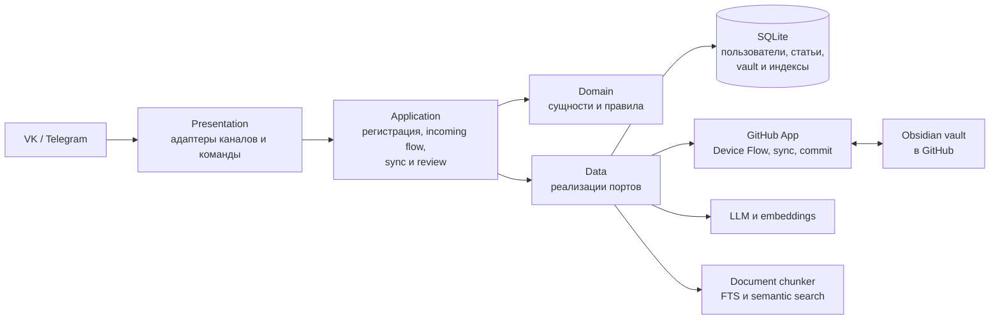

# Knowledge Catcher

Knowledge Catcher — бот, который помогает превращать статьи в пополняемый Obsidian vault. Он принимает ссылку, извлекает и анализирует материал, ищет связанные заметки, предлагает изменение в Markdown и записывает его в GitHub только после явного подтверждения пользователя.

## Статус

Production-развёртывание на VPS завершено для VK: регистрация, синхронизация vault, обработка статьи и GitHub write-back проверены в полном сценарии. Доступ к Telegram Bot API с российских VPS временно ограничен; решение с прокси или VPN вынесено в [бэклог](docs/ROADMAP.md#доступ-telegram-bot-api-с-российских-vps).

Дальнейшее развитие проекта описано в [дорожной карте](docs/ROADMAP.md): среди отложенных направлений — Telegram на VPS, фоновое ревью статей и возможный переход на внешнюю PostgreSQL для App Platform.

## Как это работает для пользователя

1. Отправьте `/register` в доступном канале и пройдите подключение GitHub-аккаунта.
2. Пришлите ссылку на GitHub-репозиторий с Obsidian vault. Бот проверит права GitHub App и синхронизирует заметки.
3. Отправьте ссылку на статью. Бот извлечёт текст, подготовит анализ и найдёт связанные заметки vault.
4. Бот покажет proposal: добавить заметку, обновить существующую или пропустить запись.
5. Ответьте `да` или `нет`. При `да` бот создаст commit в GitHub; при `нет` vault останется без изменений.

Повторная отправка той же статьи использует сохранённый результат, если он уже есть. Для ручной синхронизации vault доступна команда `/github_sync`.

## Техническая схема

Слои зависят внутрь: `presentation` вызывает `application`; `application` использует правила `domain` и порты; `data` реализует порты для SQLite, GitHub и AI-провайдеров. Подробная схема компонентов и сценариев находится в [ARCHITECTURE.md](docs/ARCHITECTURE.md).

## Быстрый старт

Для локальной подготовки смотрите [SETUP.md](docs/SETUP.md), для запуска и проверок — [RUN.md](docs/RUN.md). Подключение GitHub App и vault описано в [GITHUB_APP.md](docs/GITHUB_APP.md). Секреты хранятся только в локальном `.env` и каталоге `data/`, в Git они не попадают.

## Production VPS

Порядок эксплуатации production-сервиса, обновления, диагностика и резервные копии описаны в [OPERATIONS.md](docs/OPERATIONS.md).

## Документация

- [Архитектура](docs/ARCHITECTURE.md) — слои, компоненты и потоки данных.
- [Запуск и проверки](docs/RUN.md) — локальный запуск, healthcheck и smoke-сценарии.
- [Эксплуатация](docs/OPERATIONS.md) — production VPS, обновления, логи и backup.
- [Production VPS](docs/PRODUCTION.md) — контекст доступа и текущее состояние сервера без секретов.
- [GitHub App](docs/GITHUB_APP.md) — настройка прав и подключение Obsidian vault.
- [Дорожная карта](docs/ROADMAP.md) — завершённые этапы и бэклог.
- [Журнал решений](docs/DECISIONS.md) — архитектурные решения и их причины.
- [Document chunker](docs/DOCUMENT_CHUNKER.md) — выделенный модуль разбиения документов.
