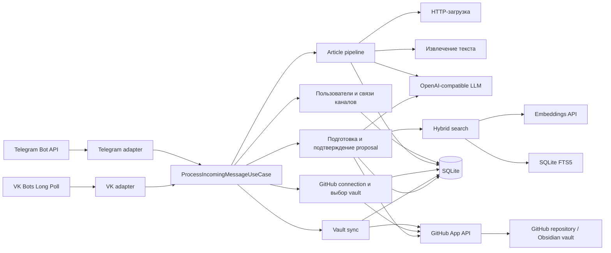
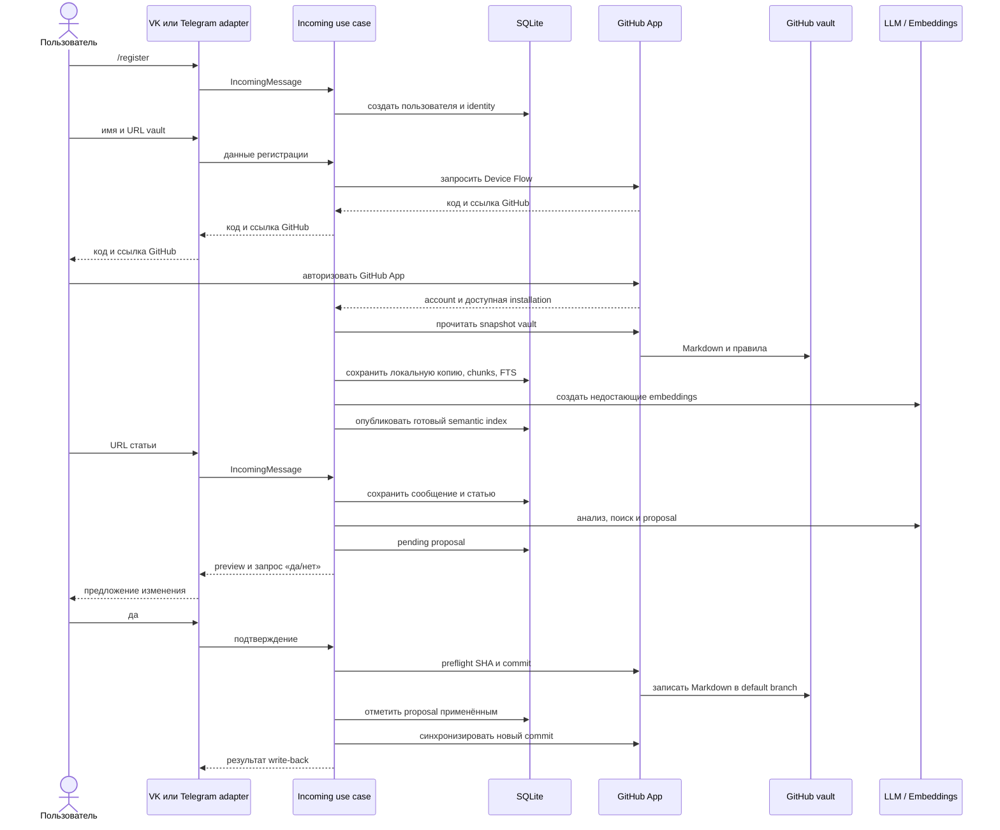

# Архитектура Knowledge Catcher

## Назначение

Knowledge Catcher принимает ссылки на статьи из мессенджера, извлекает и анализирует их
текст, сопоставляет материал с Obsidian vault в GitHub и готовит предложение изменения
заметки. Изменение попадает в vault только после явного подтверждения пользователя.

Каждый пользовательский профиль может быть доступен из нескольких внешних каналов;
данные профилей изолированы друг от друга. Сейчас production-развёртывание работает
через VK на VPS. Telegram adapter реализован и используется локально, однако на текущем российском VPS он временно не
получает сообщения из-за недоступности `api.telegram.org`; решение с прокси вынесено в
[бэклог](ROADMAP.md#доступ-telegram-bot-api-с-российских-vps).

## Компоненты и зависимости

Код разделён на четыре слоя.

| Слой | Роль | Примеры |
| --- | --- | --- |
| `domain` | Чистые сущности, статусы и правила предметной области. Не зависит от инфраструктуры. | статьи, пользователи и внешние identities, vault, заметки, proposal, lease синхронизации. |
| `application` | Пользовательские сценарии и ports (Protocol) для внешних зависимостей. | обработка входящего сообщения и URL, анализ статьи, GitHub Device Flow, выбор и синхронизация vault, поиск, подготовка и подтверждение proposal. |
| `data` | Реализации ports и работа с внешней средой. | SQLite repositories и миграция, GitHub App HTTP-клиент, OpenAI-compatible LLM и embeddings, `trafilatura`, HTTP-загрузчик, Markdown chunker, конфигурация. |
| `presentation` | Внешние точки входа и форматирование ответов. | Telegram polling, VK Bots Long Poll, CLI и healthcheck. |

Направление зависимостей: `presentation` вызывает `application`; `application` знает
`domain` и собственные ports; `data` реализует эти ports; `domain` не зависит от трёх
остальных слоёв. Это позволяет подключать новый канал без дублирования сценария
обработки статьи.

### Composition root

`obs_chat_bot/bootstrap.py` — composition root. Он собирает application-сервисы из
конкретных SQLite, GitHub, HTTP, extraction и LLM-адаптеров. CLI в
`presentation/cli/main.py` читает конфигурацию, создаёт этот граф зависимостей и
запускает один из adapters. Поэтому бизнес-сценарии не создают HTTP-клиенты,
соединения SQLite или SDK сами.

Docker Compose запускает два независимых worker-контейнера из одного образа:
`tg_catcher` с Telegram polling и `vk_catcher` с VK Long Poll. Оба используют общий
том `data/`, в котором находятся SQLite и файл ключа GitHub App. Каждый adapter
преобразует сообщение платформы в общую application-модель `IncomingMessage`, быстро
подтверждает получение и передаёт дальнейшую работу `ProcessIncomingMessageUseCase`.

## Основные компоненты

### Пользователи и каналы

`UserIdentityService` создаёт внутреннего пользователя через `/register` и хранит
отдельные внешние identities для Telegram и VK. Команда `/link_code` создаёт короткий
код, а `/link <код>` связывает второй канал с тем же пользователем. Статьи, vault,
заметки и поисковые индексы всегда ограничены `app_user_id`, поэтому данные разных
пользователей не смешиваются.

### GitHub App и подключение vault

GitHub App использует два типа краткоживущего доступа:

- GitHub Device Flow подтверждает, что пользователь авторизовал свой GitHub-аккаунт.
  `GitHubConnectionCoordinator` ожидает результат в фоне и сохраняет account и IDs
  доступных App installations в SQLite.
- Для проверки, чтения и записи выбранного vault GitHub App выпускает installation
  token с доступом к конкретному репозиторию. Такой token не хранится в БД и не
  выводится в логи.

Пользователь отправляет URL репозитория после `/register`. Сервис проверяет, что App
установлено на этот репозиторий с правом `Contents: read and write`, затем сохраняет
выбранный vault и запускает первую синхронизацию. В корне vault ожидается
`.knowledge-catcher.yml` версии 1 с путями к instruction-файлам.

### Локальная копия vault и поиск

GitHub-репозиторий является источником истины для Obsidian vault. SQLite хранит его
локальную рабочую копию: Markdown-заметки, файлы правил, метаданные, chunks, FTS5 и
embeddings. При большом числе изменившихся файлов GitHub snapshot скачивается одним ZIP-архивом
конкретного commit при соблюдении безопасных лимитов; иначе читаются только изменившиеся
blobs. Новый snapshot проверяется до применения, поэтому ошибка конфигурации или
загрузки не заменяет последнюю пригодную локальную копию.

Markdown разбирается пакетом `document_chunker` в устойчивые chunks с заголовочным
контекстом и хешем содержимого. SQLite FTS5 даёт лексический поиск по chunks.
Semantic-индекс хранит вектор как `float32` BLOB, связан с chunk, его хешем и моделью.
Неизменившиеся chunks переиспользуют уже сохранённые embeddings. Гибридный поиск
сочетает BM25 и cosine similarity через Reciprocal Rank Fusion. Если semantic-индекс
не готов или embeddings временно недоступны, используется явный FTS fallback; его
статус показывается в ответах синхронизации.

### Pipeline статьи и proposal

Общий сценарий обрабатывает ссылку так:

1. HTTP-адаптер безопасно загружает страницу, не допуская private, loopback и
   link-local адреса даже после redirect.
2. `trafilatura` извлекает содержательный текст, статья и входящее сообщение
   сохраняются в SQLite.
3. OpenAI-compatible LLM создаёт и сохраняет анализ статьи.
4. Актуальность vault проверяется общим incoming flow ещё до обработки URL
   (проверка не чаще раза в шесть часов). После анализа hybrid search подбирает
   релевантные заметки, а LLM с правилами vault готовит `add`, `update` или `skip`.
5. Пользователь видит preview Markdown и отвечает `да` либо `нет`. До `да` GitHub не
   меняется.

### Подтверждённый write-back

`ObsidianProposalConfirmationService` применяет только pending proposal. Перед
записью он читает актуальное состояние target-файла в GitHub и проверяет SHA. Если
другой автор уже изменил файл, proposal переходит в `conflict`, а не перезаписывает
чужой Markdown. При неоднозначном ответе сети сервис сопоставляет remote Markdown с
ожидаемым: если commit уже создан, локальная транзакция завершается без повторной
записи. После удачного commit запускается синхронизация vault, чтобы SQLite, FTS и
embeddings соответствовали GitHub.

## Гарантии и ограничения

- **Согласованность локального индекса.** Source SHA snapshot продвигается только
  после успешной проверки и сохранения. Готовый marker semantic-индекса публикуется
  только после полного набора vectors; частично сохранённые checkpoints будут
  продолжены при следующей синхронизации, но не используются semantic search.
- **Один владелец операции.** SQLite lease координирует Telegram и VK: для одного
  vault одновременно выполняется только одна синхронизация или write-back. Истёкший
  lease можно безопасно захватить повторно.
- **Явное изменение GitHub.** LLM не пишет в vault напрямую. Сначала сохраняется
  proposal, затем пользователь явно подтверждает его. Ошибка write-back оставляет
  proposal pending для повторной попытки; конфликт не затирает удалённые изменения.
- **Сохранность данных.** Production SQLite и PEM находятся на постоянном диске VPS
  вне Docker-образа. На сервере выполняется ежедневная SQLite backup-копия с
  проверкой целостности и хранением семи последних экземпляров. Эти копии защищают
  от ошибки приложения, но лежат на том же диске; резервирование VM вне сервера
  остаётся отдельной задачей эксплуатации.
- **Текущая граница production.** VK-сценарий регистрации, синхронизации и
  подтверждённого GitHub write-back проверен на VPS. Telegram требует отдельной
  настройки исходящего прокси или VPN для данного российского хостинга.

## Связанные документы

- [RUN.md](RUN.md) — локальный запуск, smoke-проверки и пользовательские команды.
- [OPERATIONS.md](OPERATIONS.md) — эксплуатация VPS, обновление, логи и backup.
- [GITHUB_APP.md](GITHUB_APP.md) — создание и настройка GitHub App.
- [DOCUMENT_CHUNKER.md](DOCUMENT_CHUNKER.md) — правила разбиения Markdown на chunks.
- [DECISIONS.md](DECISIONS.md) — принятые архитектурные решения.
- [ROADMAP.md](ROADMAP.md) — завершённые этапы, известные ограничения и бэклог.

